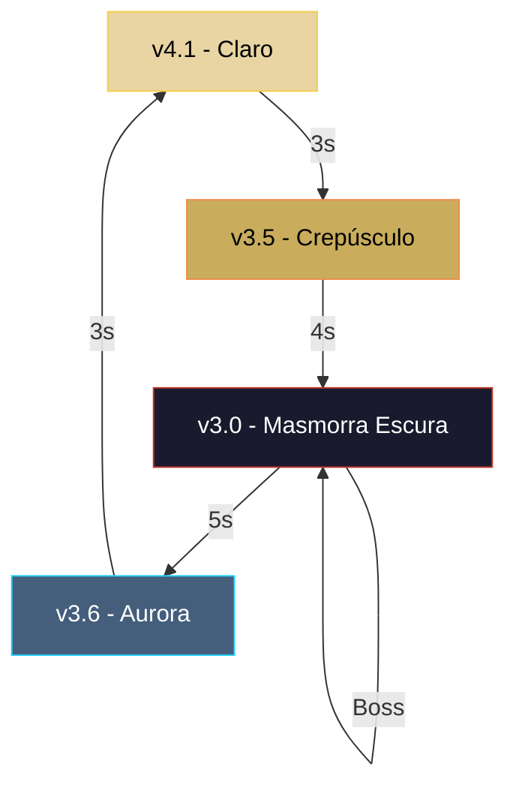
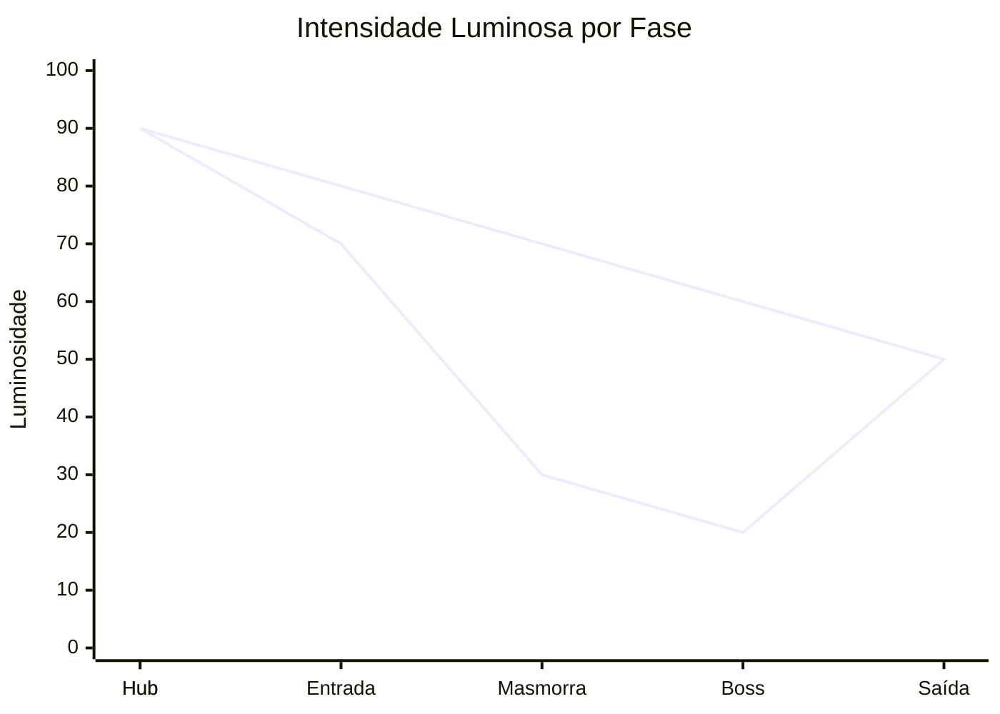

---

```markdown
# 🎨 Paletas Steampunk – Referência Visual para Roguelike em Pixel Art

> Sistema de paletas de cores para um jogo **Roguelike Steampunk de Viagem no Tempo** com arte em **Pixel Art 64x64**.  
> Baseado em neurociência visual, teoria das cores e acessibilidade (WCAG).

[](https://github.com/N01T3/paletas)
[](https://n01t3.github.io/paletas/)

---

## 📖 Visão Geral

Este repositório contém a **referência visual completa** das 4 paletas de cores desenvolvidas para o jogo, incluindo:

- Tabelas de cores com códigos HEX e RGB
- Exemplos de UI (HP, Stamina, Minimap)
- Aplicação em personagens (Herói, NPC, Inimigos)
- Regras de contraste e acessibilidade
- Workflow de transição entre paletas (Dia → Crepúsculo → Noite → Aurora)

As paletas foram projetadas para **transições suaves e imersivas**, respeitando a adaptação da pupila e reduzindo a fadiga visual em longas sessões de jogo.

---

## 🌗 As 4 Paletas

| Geração | Paleta | Momento / Função | Clima |
| :---: | :--- | :--- | :--- |
| 1ª | 🎨 **v3.0 – Masmorra Escura** | Masmorras profundas, combate, boss | Opressiva, steampunk pesado |
| 2ª | ☀️ **v4.1 – Airship Steampunk** | Cidades, hubs, áreas externas diurnas | Clara, quente, confortável |
| 3ª | 🌆 **v3.5 – Crepúsculo Steampunk** | Corredores, transição Dia → Noite | Bronze envelhecido, luz moderada |
| 4ª | 🌅 **v3.6 – Aurora Steampunk** | Saída da masmorra, pós-boss, amanhecer | Noite → Dia, tons frios e pontos quentes |

---

## 🚀 Como visualizar

| Opção | Link |
| :--- | :--- |
| 🌐 **GitHub Pages** | [https://n01t3.github.io/paletas/](https://n01t3.github.io/paletas/) |
| 📁 **Repositório** | [https://github.com/N01T3/paletas](https://github.com/N01T3/paletas) |

### Localmente
1. Clone o repositório:
   ```bash
   git clone https://github.com/N01T3/paletas.git
   ```
2. Abra o arquivo `index.html` no seu navegador.

> **Nota:** A página carrega a biblioteca Mermaid.js via CDN para renderizar diagramas. É necessária conexão com a internet.

---

## 📁 Estrutura do Projeto

```
/
├── index.html          # Página principal com todas as paletas
├── README.md           # Este arquivo
└── assets/             # (opcional) imagens, ícones, etc.
```

---

## 🛠️ Workflow de Transição

As paletas são projetadas para transição gradual via **shader de substituição de paleta com interpolação linear (Lerp)**.

### Fluxo de transição (jornada visual do jogador)



### Diagrama de intensidade luminosa



---

## 🧠 Fundamentos Científicos

- **Adaptação da pupila:** Transições graduais (3~5 segundos) preparam o sistema visual do jogador para mudanças de luminosidade.
- **Pré-atenção:** Cores de destaque (Vermelho, Amarelo, Verde) são detectadas pelo cérebro em <200ms, guiando o jogador sem texto.
- **Daltonismo:** Todas as informações críticas são acompanhadas de **formas** (♥ coração, ⚡ raio, ★ estrela) e **texturas**.
- **Contraste WCAG:** Todas as combinações de texto e UI possuem razão de contraste ≥ 4.5:1 (nível AA).

---

## 📋 Exemplo de Uso – Shader de Transição

```hlsl
// Shader de substituição de paleta com interpolação
Texture2D _PaletteA; // Paleta de origem
Texture2D _PaletteB; // Paleta de destino
float _Blend;        // Fator de interpolação (0-1)

float4 frag(v2f i) : SV_Target {
    float4 originalColor = tex2D(_MainTex, i.uv);
    int index = FindClosestColorIndex(originalColor, _PaletteA);
    float4 colorA = tex2D(_PaletteA, float2((index + 0.5)/32.0, 0.5));
    float4 colorB = tex2D(_PaletteB, float2((index + 0.5)/32.0, 0.5));
    return lerp(colorA, colorB, _Blend);
}
```

---

## 👥 Contribuição

Sinta-se à vontade para abrir **issues** ou **pull requests** com sugestões de melhoria nas paletas, ajustes de contraste ou novos esquemas de cores.

---

## 📜 Licença

Este projeto é disponibilizado sob a licença **MIT**.  
Consulte o arquivo `LICENSE` para mais detalhes.

---

## 🙏 Créditos

- **Criação e curadoria:** Equipe de Desenvolvimento do Jogo
- **Base científica:** Teoria das Cores, Neurociência Visual e Diretrizes WCAG
- **Ferramentas:** Mermaid.js, GitHub Pages, Visual Studio Code

---

## 🔗 Links Úteis

- [📂 Repositório no GitHub](https://github.com/N01T3/paletas)
- [🌐 Página no GitHub Pages](https://n01t3.github.io/paletas/)

---

**Última atualização:** 2026-08-12  
**Versão do documento:** 2.0
```
